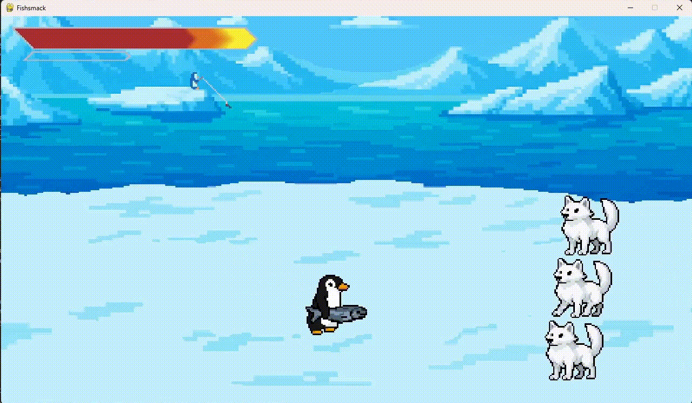

# Fishsmack
A 2D beat 'em up game set in the arctic, built with Pygame and Aseprite.
Play as a penguin wielding a fish and fight your way through waves of enemies to defeat the final boss.

---

## Demo
  

[Fishsmack Demo](fishsmackDemo.mp4)

---  

### FOR PFDA
**Commentary Vid + Link to Github**  
https://www.youtube.com/watch?v=YVcPgKtNxks  
https://github.com/ryckylol/Fishsmack

---
## Controls
**WASD** - Movement  
**J** - Light Attack (Can cancel into itself or other attacks)  
**K** - Heavy Attack (Using Heavy attack puts every attack EXCEPT Special attacks on cooldown)  
**L** - Special attack *(requires full meter)*  

Build meter by dealing damage. Taking damage reduces your meter.

Common combos:  
J > J > J (Light, Light, Light)  
J > J > K (Light, Light, Heavy)

---

## Gameplay
- Play as a penguin with three attack types: Basic, Heavy, and Special
- Defeat waves of arctic enemies:
    - Arctic Fox
    - Seal
    - Giant Petrel
    - Polar Bear
- Progress through 4 waves, each introducing or combining enemies.
- Use your combat skills and meter system to reach and defeat the final boss.

---

## Requirements
- Python 3.8+---
- [Pygame](https://www.pygame.org/)  

---

## Possible Future Improvements
While Fishsmack is fully playable in its current form, there are several areas that could be improved on to enhance player experience and deepen gameplay.

### **Additional Enemy Variety**
New enemy types with distinct movement patterns, attack styles, or defensive behaviors would deepen the player experience

### **Expanded Combo System** 
A more advanced combo system, such as aerial attacks, juggle mechanics, or designated combo tools would create more depth and creativity to the combat.

### **Improved Visuals + Stage Variety**
A parallax-scrolling background and movement between different stages would liven the environment

### **SFX Enhancements**
Currently there are only three sources of audio in the game, background music, the fish slap sfx, and the polar bears roar.

### **New Modes**
Additional modes would help extend playtime:
- **Infinite/Survival Mode with endless waves**
- **Boss Rush**
- **Difficulty Scalings**

## **Story or Cutscenes**
Intros or any type of narrative could add more personality to the enemies (currently there is only one cutscene-like element)

## **Optimization**
The collision on certain hitboxes can feel unfair at times and the enemy AI needs refining.